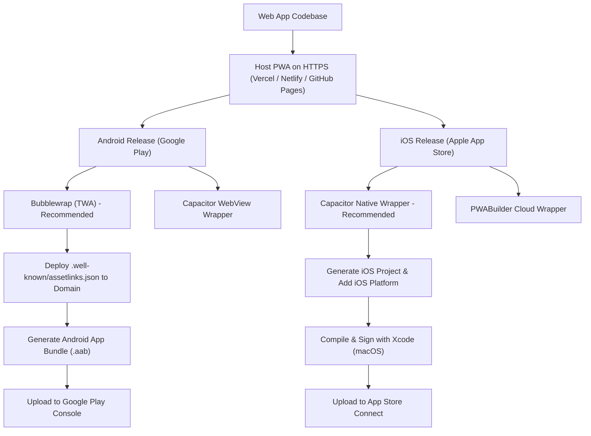
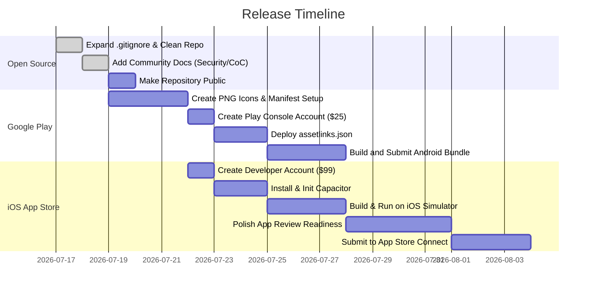

# Travel Planner: App Stores Release & Open Source Roadmap

This roadmap details the steps, technologies, requirements, and checks necessary to package the **Travel Planner PWA** for the Google Play Store and Apple App Store, and to transition the repository into a production-ready open-source project.

---

## 🗺️ Publishing Pipeline Overview

The following diagram illustrates the deployment and packaging pipeline for releasing the PWA to both major mobile app stores:



---

## 📊 Mobile Packaging Options Comparison

To wrapper the PWA for the app stores, we have three main paths. The table below outlines how they compare:

| Feature / Metric | PWABuilder | Capacitor (Recommended for iOS) | Bubblewrap (Recommended for Android) |
| :--- | :--- | :--- | :--- |
| **Platform Support** | iOS & Android | iOS & Android | Android only |
| **Packaging Architecture** | Cloud-based generator | Native WKWebView / WebView wrapper | Trusted Web Activity (TWA) |
| **Ease of Setup** | Extremely Easy (Web UI) | Moderate (Requires node config) | Easy (CLI tool) |
| **Build Environment** | Cloud (No macOS needed for iOS project generation) | Local (Requires macOS / Xcode to compile iOS) | Local (Requires Node, Java, and Android SDK) |
| **Custom Native Code** | Limited | High (Can write custom Swift/Kotlin plugins) | None (Runs the browser process) |
| **Store Approval Risk** | Low (if PWA behaves like an app) | Lowest (Compiles as a standard native application) | Low (Launches via the native system Chrome) |

---

## 🤖 1. Google Play Store Release Path (Android)

Google officially supports PWAs in the Play Store via **Trusted Web Activities (TWAs)**. We recommend using **Bubblewrap** or **PWABuilder** (which uses Bubblewrap under the hood) for this.

### Prerequisites & Account Setup
* **Google Play Console Account:** Requires a one-time registration fee of **$25**.
* **Public HTTPS Domain:** The app must be hosted on a secure, public HTTPS URL (e.g., GitHub Pages, Vercel, Netlify).
* **Privacy Policy URL:** A hosted privacy policy page is mandatory for Play Store listings.

### Implementation Checklist
- [x] **Generate PNG Launcher Icons:**
  - `icons/icon-192.png`, `icons/icon-512.png`, and the native 1024px iOS app icon are generated from the existing Travel Planner mark with `npm run generate:pwa-icons`.
- [x] **Configure the Web App Manifest:**
  - The manifest contains `description`, `theme_color`, `background_color`, and store-compatible PNG icon entries. Promotional screenshots remain a listing asset to capture once the production build is available.
- [ ] **Establish Digital Asset Links:**
  - Generate a `SHA-256` signing certificate fingerprint when packaging the app.
  - Deploy a file named `assetlinks.json` inside the `.well-known` directory of the hosting domain:
    ```json
    [
      {
        "relation": ["delegate_permission/common.handle_all_urls"],
        "target": {
          "namespace": "android_app",
          "package_name": "com.yourname.travelplanner",
          "sha256_cert_fingerprints": ["YOUR_SHA256_FINGERPRINT_HERE"]
        }
      }
    ]
    ```
    > [!IMPORTANT]
    > If Digital Asset Links are not configured or are misconfigured, the packaged app will open with an address bar showing at the top, which violates Google Play PWA policies.

---

## 🍏 2. Apple App Store Release Path (iOS)

Apple does not support TWAs. To release on iOS, we must wrap the web application inside a native shell using `WKWebView`. **Capacitor** is the modern, recommended framework for this.

### Prerequisites & Account Setup
* **Apple Developer Program Membership:** Requires a yearly subscription of **$99**.
* **macOS Machine & Xcode:** Required to compile the app, sign the package, and upload the `.ipa` file to App Store Connect.
* **Privacy Policy URL:** A hosted privacy policy page is mandatory.

### Apple App Store Guidelines warning
> [!WARNING]
> **Apple Review Guideline 4.2 (Minimum Functionality)**
> Apple frequently rejects web wrappers that are "simply a website inside an app frame."
> To pass review, the application must feel like a premium, native application. Travel Planner is in a great position to pass because:
> 1. It operates **offline-first** (using browser storage and caching).
> 2. It has an application layout rather than a typical blog/marketing website.
> 3. It utilizes native-like interactions (drag-and-drop itinerary sorting, modals).
> 
> *To further secure approval, we should consider integrating at least one native feature via Capacitor APIs, such as native Share sheets, local notifications, or haptic feedback.*

### Implementation Checklist
- [x] **Initialize Capacitor:**
  - Capacitor uses `capacitor.config.json` with bundle identifier `com.trentan.travelplanner` and the generated `.capacitor-web` bundle.
- [x] **Add iOS Platform Support:**
  - `@capacitor/core`, `@capacitor/ios`, and `@capacitor/cli` are installed, and the native project lives in `ios/`.
- [x] **Build & Sync Web Assets:**
  - Run `npm run build:mobile` to compile CSS, create the mobile web bundle, and sync it into the iOS project.
- [ ] **Configure Icons & Splash Screens:**
  - Use `@capacitor/assets` or PWABuilder to generate the Xcode icon sets and launch storyboards.
- [ ] **Open Xcode & Sign:**
  - Open Xcode: `npx cap open ios`
  - Select your developer team, sign the app, and run on a Simulator or connected iPhone for testing.
  - Archive and submit the build to App Store Connect.

---

## 🌐 3. Open Source Transition Checklist

To transition the private codebase into a public, open-source project, we need to ensure codebase cleanliness, clean git history, security hygiene, and clear developer guidelines.

### A. Security & Secret Scanning
> [!IMPORTANT]
> **Secret Verification**
> We verified that Travel Planner is a 100% client-side application. The AI Builder generates a prompt for the user to copy/paste into external models, meaning there are **no hardcoded API keys or server credentials** in the repository.
> However, we should still run a git history scan (e.g., using `gitleaks` or `trufflehog`) before publishing to make sure no personal developer files or credentials have ever been committed.

### B. Repository Cleanliness & Git Hygiene
- [x] **Expand the `.gitignore` File:**
  - Updated to ignore compiler assets, IDE configuration files, and test runner outputs.
- [ ] **Clean Up Build & Test Artifacts:**
  - Ensure local folders like `dist/` and `test-results/` are untracked in git before pushing.

### C. Community & Project Documentation
- [x] **Create a Code of Conduct (`CODE_OF_CONDUCT.md`):**
  - Standard Contributor Covenant v2.1 added.
- [x] **Create a Security Policy (`SECURITY.md`):**
  - Vulnerability report guidelines added.
- [ ] **Add Issue Templates (`.github/ISSUE_TEMPLATE/`):**
  - Set up structured issue templates for bug reports and feature requests.
- [ ] **Publishing Workflow:**
  - Ensure the CI workflow (`.github/workflows/ci.yml`) triggers and runs successfully for community contributions.

---

## 📈 Summary of Next Steps

To move forward with these releases, here is the suggested chronological order:


