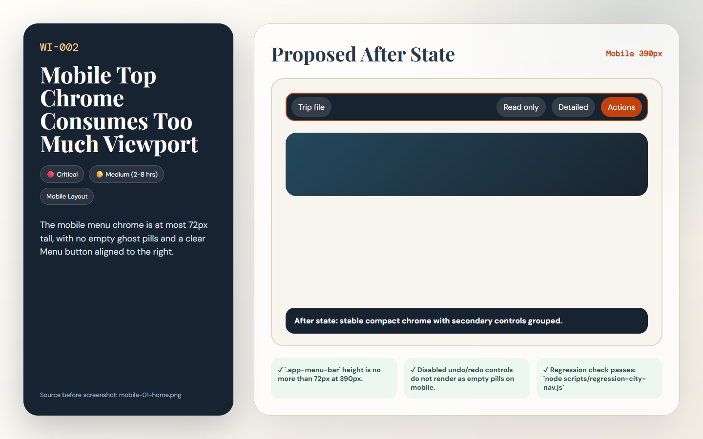

# [WI-002] Mobile Top Chrome Consumes Too Much Viewport

| Field | Value |
|-------|-------|
| Priority | 🔴 Critical |
| Effort | 🟡 Medium (2-8 hrs) |
| Dimension | Mobile Layout |
| Status | 🔲 Todo |
| Before screenshot | `screenshots/before/mobile-01-home.png` |
| Proposal image | `items/proposals/WI-002-proposal.png` |
| Actual after screenshot | `screenshots/after/WI-002-after.png` (capture after implementation) |
| Files to change | `style.css` · `index.html` · `js/ui.js` |

---

## Problem

On 390px mobile the file badge, hidden disabled controls, detailed-mode switch, and Menu button create a 117px dark menu bar before the hero even starts. This crowds the first viewport and leaves odd ghost pills under the filename.

## Before (current state)

## Before image


> Screenshot: `../screenshots/before/mobile-01-home.png`  
> Callout: Look at the affected area described above; the captured state shows the current failure mode for WI-002.

## Proposed fix

Use a two-line mobile app chrome only when necessary: a compact filename/status row and a single action row. Hide disabled undo/redo completely and shorten the filename with a label like "Trip file".

```css
/* BEFORE */
.target-selector { /* current layout clips, wraps, or undersizes at the tested viewport */ }

/* AFTER */
.target-selector { /* responsive layout meets the acceptance criteria for WI-002 */ }
```

## Proposal image



## After (proposed state description)

The mobile menu chrome is at most 72px tall, with no empty ghost pills and a clear Menu button aligned to the right.

## Acceptance criteria

- [ ] `.app-menu-bar` height is no more than 72px at 390px.
- [ ] Disabled undo/redo controls do not render as empty pills on mobile.
- [ ] Regression check passes: `node scripts/regression-city-nav.js`

## How to implement

1. Open the listed source files and locate the selector or builder named in the proposed fix.
2. Apply the responsive or structural change without changing unrelated trip data behavior.
3. Re-run screenshots for the affected view and save the real completed state to `screenshots/after/WI-002-after.png`.
