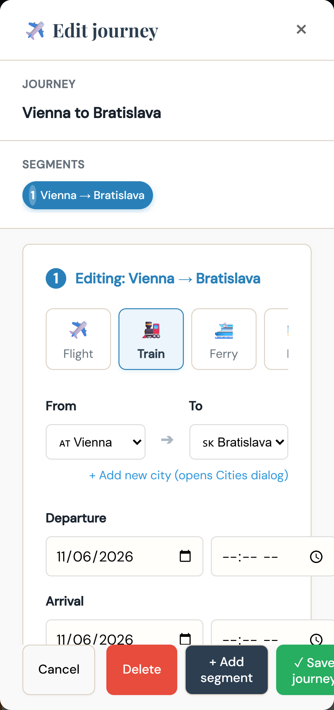
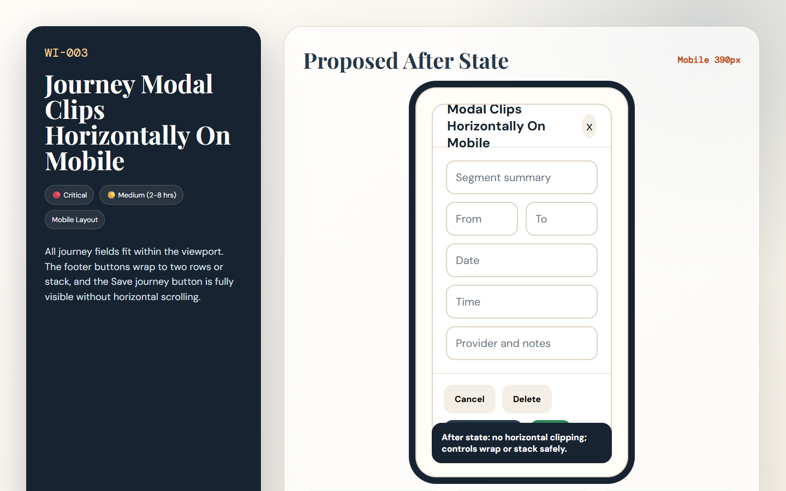

# [WI-003] Journey Modal Clips Horizontally On Mobile

| Field | Value |
|-------|-------|
| Priority | 🔴 Critical |
| Effort | 🟡 Medium (2-8 hrs) |
| Dimension | Mobile Layout |
| Status | 🔲 Todo |
| Before screenshot | `screenshots/before/mobile-08-journey-modal-top.png` |
| Proposal image | `items/proposals/WI-003-proposal.png` |
| Actual after screenshot | `screenshots/after/WI-003-after.png` (capture after implementation) |
| Files to change | `style.css` · `index.html` |

---

## Problem

The journey modal form is wider than the 390px viewport. The transport type row, date/time fields, and sticky footer actions are clipped, including the Save journey button.

## Before (current state)

## Before image



> Screenshot: `../screenshots/before/mobile-08-journey-modal-top.png`  
> Callout: Look at the affected area described above; the captured state shows the current failure mode for WI-003.

## Proposed fix

Add mobile-specific rules for `#journey-modal .modal-content`, the inline form rows, `.transport-type-group`, and `.modal-footer` so content stacks vertically and the footer scrolls or wraps safely.

```css
/* BEFORE */
.target-selector { /* current layout clips, wraps, or undersizes at the tested viewport */ }

/* AFTER */
.target-selector { /* responsive layout meets the acceptance criteria for WI-003 */ }
```

## Proposal image



## After (proposed state description)

All journey fields fit within the viewport. The footer buttons wrap to two rows or stack, and the Save journey button is fully visible without horizontal scrolling.

## Acceptance criteria

- [ ] No horizontal overflow in `#journey-modal` at 390px.
- [ ] Save journey, Add segment, Delete, and Cancel are fully visible and tappable.
- [ ] Regression check passes: `node scripts/regression-city-nav.js`

## How to implement

1. Open the listed source files and locate the selector or builder named in the proposed fix.
2. Apply the responsive or structural change without changing unrelated trip data behavior.
3. Re-run screenshots for the affected view and save the real completed state to `screenshots/after/WI-003-after.png`.
