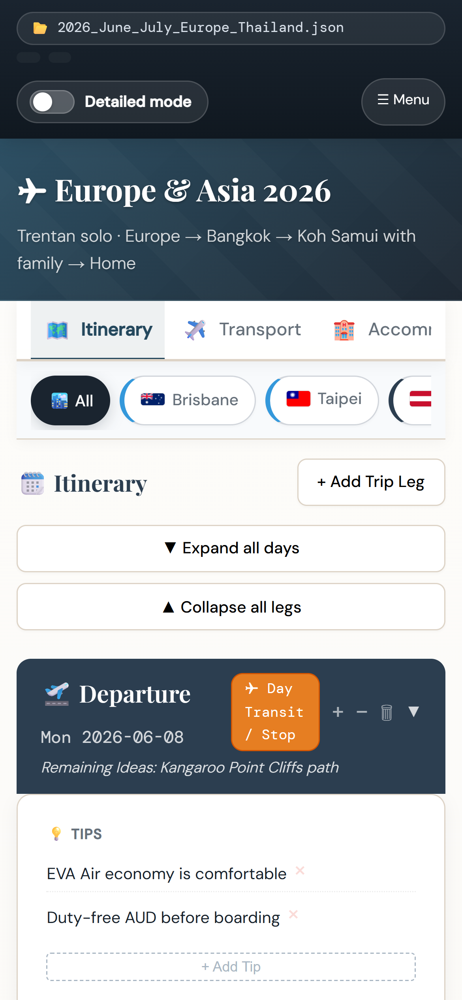
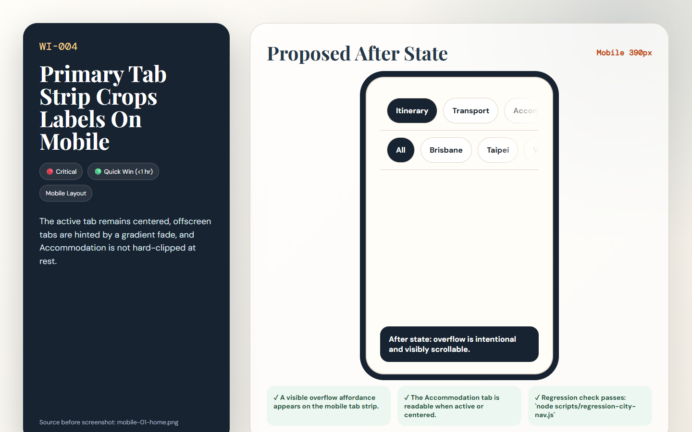

# [WI-004] Primary Tab Strip Crops Labels On Mobile

| Field | Value |
|-------|-------|
| Priority | 🔴 Critical |
| Effort | 🟢 Quick Win (<1 hr) |
| Dimension | Mobile Layout |
| Status | 🔲 Todo |
| Before screenshot | `screenshots/before/mobile-01-home.png` |
| Proposal image | `items/proposals/WI-004-proposal.png` |
| Actual after screenshot | `screenshots/after/WI-004-after.png` (capture after implementation) |
| Files to change | `style.css` |

---

## Problem

The primary tab strip is horizontally scrollable but has no fade, arrow, or scrollbar. The Accommodation label is visibly cropped to "Accomm", which makes navigation look unfinished.

## Before (current state)

## Before image



> Screenshot: `../screenshots/before/mobile-01-home.png`  
> Callout: Look at the affected area described above; the captured state shows the current failure mode for WI-004.

## Proposed fix

Add left/right edge fades to `.app-tabs-nav`, preserve scroll snapping, and reduce mobile tab padding/font size so full labels have a better chance of fitting.

```css
/* BEFORE */
.target-selector { /* current layout clips, wraps, or undersizes at the tested viewport */ }

/* AFTER */
.target-selector { /* responsive layout meets the acceptance criteria for WI-004 */ }
```

## Proposal image



## After (proposed state description)

The active tab remains centered, offscreen tabs are hinted by a gradient fade, and Accommodation is not hard-clipped at rest.

## Acceptance criteria

- [ ] A visible overflow affordance appears on the mobile tab strip.
- [ ] The Accommodation tab is readable when active or centered.
- [ ] Regression check passes: `node scripts/regression-city-nav.js`

## How to implement

1. Open the listed source files and locate the selector or builder named in the proposed fix.
2. Apply the responsive or structural change without changing unrelated trip data behavior.
3. Re-run screenshots for the affected view and save the real completed state to `screenshots/after/WI-004-after.png`.
