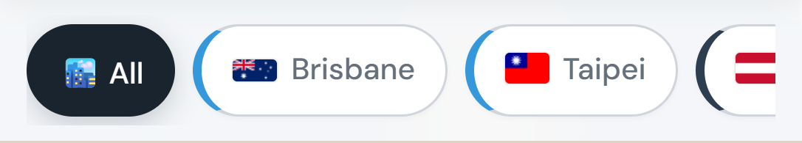
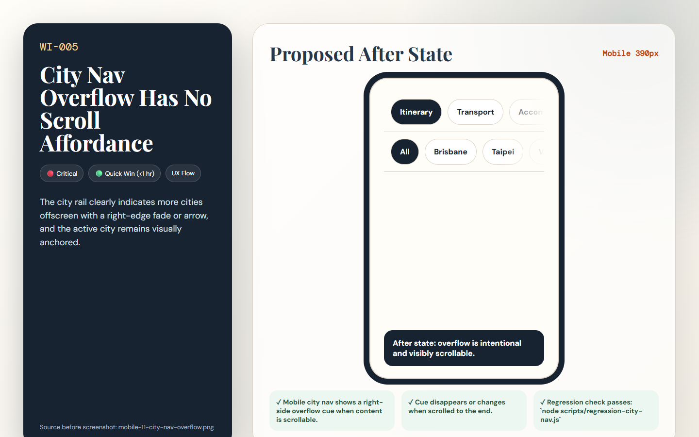

# [WI-005] City Nav Overflow Has No Scroll Affordance

| Field | Value |
|-------|-------|
| Priority | 🔴 Critical |
| Effort | 🟢 Quick Win (<1 hr) |
| Dimension | UX Flow |
| Status | ✅ Done |
| Before screenshot | `screenshots/before/mobile-11-city-nav-overflow.png` |
| Proposal image | `items/proposals/WI-005-proposal.png` |
| Actual after screenshot | [screenshots/after/WI-005-after.png](../screenshots/after/WI-005-after.png) (captured 2026-05-16) |
| Files to change | `style.css` · `js/itinerary.js` |

---

## Problem

The city nav has a 337px viewport and about 1829px of scrollable content on mobile. The scrollbar is hidden and there is no fade or arrow, so most cities are undiscoverable.

## Before (current state)

## Before image



> Screenshot: `../screenshots/before/mobile-11-city-nav-overflow.png`  
> Callout: Look at the affected area described above; the captured state shows the current failure mode for WI-005.

## Proposed fix

Wrap `.city-nav-list` in a visual fade treatment or add pseudo-element fades on `.city-nav`. Optionally add scroll shadows that disappear at either end.

```css
/* BEFORE */
.target-selector { /* current layout clips, wraps, or undersizes at the tested viewport */ }

/* AFTER */
.target-selector { /* responsive layout meets the acceptance criteria for WI-005 */ }
```

## Proposal image



## After (proposed state description)

The city rail clearly indicates more cities offscreen with a right-edge fade or arrow, and the active city remains visually anchored.

## Acceptance criteria

- [x] Mobile city nav shows a right-side overflow cue when content is scrollable.
- [x] Cue disappears or changes when scrolled to the end.
- [x] Regression check passes: `node tests/run-tests.js`

## How to implement

1. Open the listed source files and locate the selector or builder named in the proposed fix.
2. Apply the responsive or structural change without changing unrelated trip data behavior.
3. Re-run screenshots for the affected view and save the real completed state to `screenshots/after/WI-005-after.png`.
