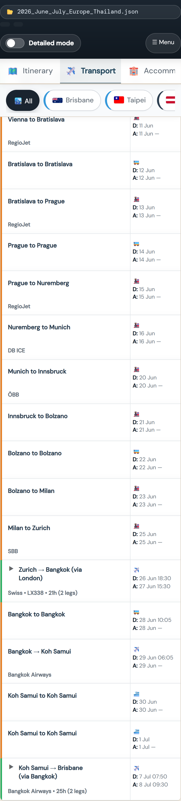
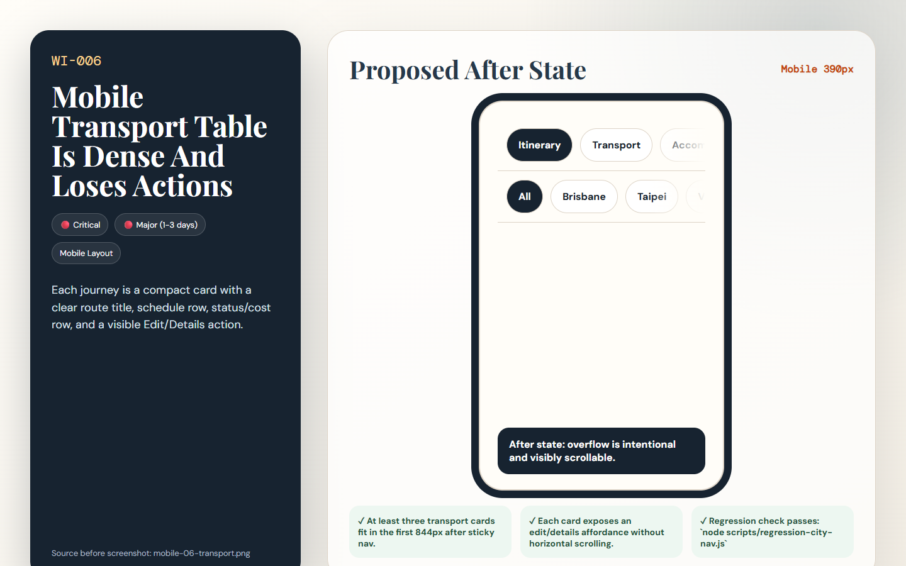

# [WI-006] Mobile Transport Table Is Dense And Loses Actions

| Field | Value |
|-------|-------|
| Priority | 🔴 Critical |
| Effort | 🔴 Major (1-3 days) |
| Dimension | Mobile Layout |
| Status | 🔲 Todo |
| Before screenshot | `screenshots/before/mobile-06-transport.png` |
| Proposal image | `items/proposals/WI-006-proposal.png` |
| Actual after screenshot | `screenshots/after/WI-006-after.png` (capture after implementation) |
| Files to change | `style.css` · `js/transport.js` |

---

## Problem

The transport tab renders as a large two-column table on mobile. Rows are tall, action controls are not visible in the first viewport, and repeated same-city journeys dominate the screen.

## Before (current state)

## Before image



> Screenshot: `../screenshots/before/mobile-06-transport.png`  
> Callout: Look at the affected area described above; the captured state shows the current failure mode for WI-006.

## Proposed fix

Replace the mobile transport table with journey cards showing route, type, departure/arrival, provider, status/cost, and an explicit details/action expander.

```css
/* BEFORE */
.target-selector { /* current layout clips, wraps, or undersizes at the tested viewport */ }

/* AFTER */
.target-selector { /* responsive layout meets the acceptance criteria for WI-006 */ }
```

## Proposal image



## After (proposed state description)

Each journey is a compact card with a clear route title, schedule row, status/cost row, and a visible Edit/Details action.

## Acceptance criteria

- [ ] At least three transport cards fit in the first 844px after sticky nav.
- [ ] Each card exposes an edit/details affordance without horizontal scrolling.
- [ ] Regression check passes: `node scripts/regression-city-nav.js`

## How to implement

1. Open the listed source files and locate the selector or builder named in the proposed fix.
2. Apply the responsive or structural change without changing unrelated trip data behavior.
3. Re-run screenshots for the affected view and save the real completed state to `screenshots/after/WI-006-after.png`.
