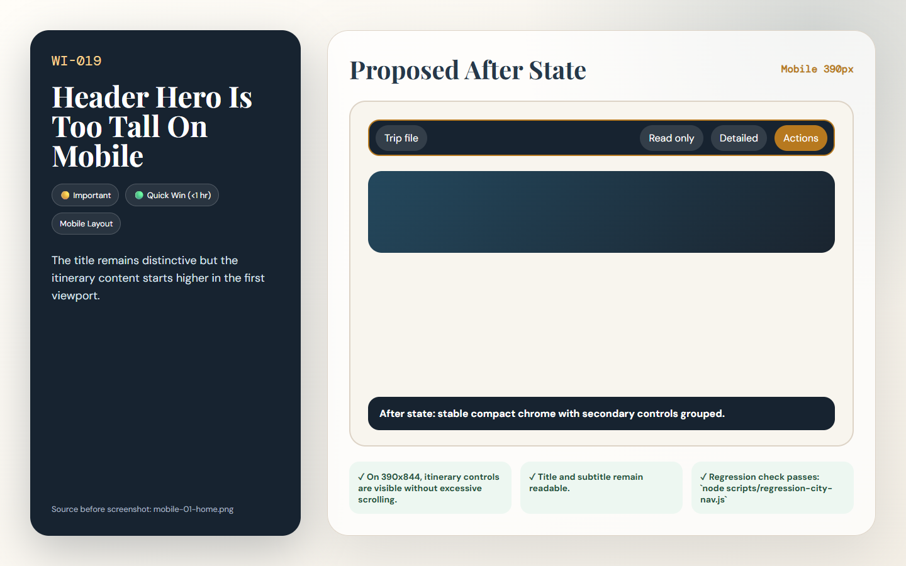

# [WI-019] Header Hero Is Too Tall On Mobile

| Field | Value |
|-------|-------|
| Priority | 🟡 Important |
| Effort | 🟢 Quick Win (<1 hr) |
| Dimension | Mobile Layout |
| Status | 🔲 Todo |
| Before screenshot | `screenshots/before/mobile-01-home.png` |
| Proposal image | `items/proposals/WI-019-proposal.png` |
| Actual after screenshot | `screenshots/after/WI-019-after.png` (capture after implementation) |
| Files to change | `style.css` |

---

## Problem

The mobile hero uses large Playfair typography and generous padding, consuming about half of the first viewport when combined with the menu bar.

## Before (current state)

## Before image


> Screenshot: `../screenshots/before/mobile-01-home.png`  
> Callout: Look at the affected area described above; the captured state shows the current failure mode for WI-019.

## Proposed fix

Reduce mobile header padding and font clamp, and keep the subtitle to two lines with a graceful fade or smaller type.

```css
/* BEFORE */
.target-selector { /* current layout clips, wraps, or undersizes at the tested viewport */ }

/* AFTER */
.target-selector { /* responsive layout meets the acceptance criteria for WI-019 */ }
```

## Proposal image



## After (proposed state description)

The title remains distinctive but the itinerary content starts higher in the first viewport.

## Acceptance criteria

- [ ] On 390x844, itinerary controls are visible without excessive scrolling.
- [ ] Title and subtitle remain readable.
- [ ] Regression check passes: `node scripts/regression-city-nav.js`

## How to implement

1. Open the listed source files and locate the selector or builder named in the proposed fix.
2. Apply the responsive or structural change without changing unrelated trip data behavior.
3. Re-run screenshots for the affected view and save the real completed state to `screenshots/after/WI-019-after.png`.
